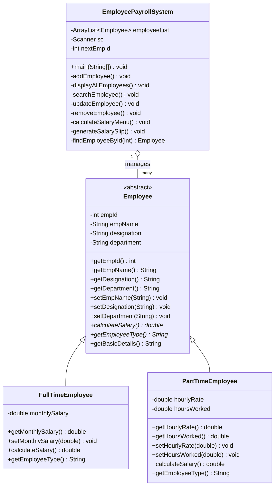

                                                      Employee Payroll System


<div align="center">

### A Core Java, Console-Based Mini Project | OOP Concepts in Action

[](https://www.java.com/)
[](https://en.wikipedia.org/wiki/Object-oriented_programming)
[](.)
[](.)
[](LICENSE)

**A menu-driven Employee Payroll System built with Core Java, demonstrating Abstraction, Inheritance, Encapsulation, and Polymorphism through a real-world payroll use case.**

</div>

---

## 📋 Table of Contents

- [Overview](#-overview)
- [Features](#-features)
- [OOP Concepts Used](#-oop-concepts-used)
- [Architecture](#-architecture)
- [Project Structure](#-project-structure)
- [Class Design](#-class-design)
- [Getting Started](#-getting-started)
- [Sample Run](#-sample-run)
- [Salary Calculation Logic](#-salary-calculation-logic)
- [Input Validation](#-input-validation)
- [Future Enhancements](#-future-enhancements)
- [Author](#-author)

---

## 🎯 Overview

**Employee Payroll System** is a beginner-friendly, academic mini project that simulates a real-world payroll management workflow entirely inside the console — no GUI, no database, no external dependencies. It stores employee records in memory using an `ArrayList<Employee>` and supports two employee types — **Full-Time** and **Part-Time** — each with its own salary calculation logic, demonstrating clean **polymorphic behavior** through method overriding.

The project is intentionally kept dependency-free (pure Core Java / `java.util`) so it compiles and runs anywhere a JDK is installed — ideal for viva demonstrations, GitHub portfolio review, and academic submission.

---

## ✨ Features

| # | Operation | Description |
|---|-----------|-------------|
| 1 | **Add Employee** | Create a Full-Time or Part-Time employee with auto-generated Employee ID |
| 2 | **View All Employees** | Neatly formatted tabular display of every record |
| 3 | **Search Employee** | Look up a record instantly by Employee ID |
| 4 | **Update Employee** | Edit name, designation, department, salary/rate, or hours worked |
| 5 | **Remove Employee** | Delete a record by ID with a confirmation prompt |
| 6 | **Calculate Salary** | Computes salary dynamically based on employee type |
| 7 | **Generate Salary Slip** | Prints a clean, itemized console salary slip |
| 8 | **Exit** | Gracefully terminates the application |

---

## 🧠 OOP Concepts Used

| Concept | Where It's Applied |
|---|---|
| **Abstraction** | `Employee` is declared `abstract` — it can never be instantiated directly, only through its subclasses |
| **Inheritance** | `FullTimeEmployee` and `PartTimeEmployee` both `extend Employee`, inheriting common fields and behavior |
| **Encapsulation** | All fields are `private`; access is strictly through public getters/setters |
| **Polymorphism** | `calculateSalary()` is overridden differently in each subclass — the same method call produces different results depending on the actual object type |

---

## 🏗️ Architecture



---

## 📁 Project Structure

```
employee-payroll-system/
│
├── EmployeePayrollSystem.java   # Single-file source: all classes + main driver
├── README.md                    # Project documentation (this file)
└── LICENSE                      # MIT License
```

> The project is intentionally kept as a **single `.java` file** containing four classes (`Employee`, `FullTimeEmployee`, `PartTimeEmployee`, `EmployeePayrollSystem`) for simple, single-command compilation — standard practice for academic mini projects.

---

## 🧩 Class Design

### `Employee` (abstract base class)
Holds common attributes shared by every employee — `empId`, `empName`, `designation`, `department` — plus two abstract methods (`calculateSalary()`, `getEmployeeType()`) that force every subclass to define its own salary logic.

### `FullTimeEmployee extends Employee`
Adds a fixed `monthlySalary` field. `calculateSalary()` simply returns this value.

### `PartTimeEmployee extends Employee`
Adds `hourlyRate` and `hoursWorked`. `calculateSalary()` returns `hourlyRate × hoursWorked`.

### `EmployeePayrollSystem` (main driver class)
Contains the `main()` method, the menu loop, an `ArrayList<Employee>` acting as the in-memory data store, and one private method per operation — fully modular, with each feature isolated for readability and easy debugging.

---

## 🚀 Getting Started

### Prerequisites
- JDK 8 or above installed
- Any terminal / command prompt

### Clone the Repository

```bash
git clone https://github.com/snehalathaArakkonam/employee-payroll-system.git
cd employee-payroll-system
```

### Compile

```bash
javac EmployeePayrollSystem.java
```

### Run

```bash
java EmployeePayrollSystem
```

---

## 🖥️ Sample Run

```
=========================================
   WELCOME TO EMPLOYEE PAYROLL SYSTEM
=========================================

===== EMPLOYEE PAYROLL SYSTEM =====
1. Add Employee
2. View All Employees
3. Search Employee
4. Update Employee
5. Remove Employee
6. Calculate Salary
7. Generate Salary Slip
8. Exit
====================================
Enter your choice: 1

--- Add New Employee ---
Enter Employee Name: Ravi Kumar
Enter Designation: Software Engineer
Enter Department: IT
Select Employee Type:
1. Full-Time
2. Part-Time
Enter choice (1-2): 1
Enter Monthly Salary: 45000

Employee added successfully! Assigned Employee ID: 101
```

```
--- All Employees ---
-------------------------------------------------------------
ID     Name               Designation     Department      Type
-------------------------------------------------------------
101    Ravi Kumar         Software Eng... IT              Full-Time
102    Suresh Babu        Assistant       Admin           Part-Time
-------------------------------------------------------------
Total Employees: 2
```

```
===================================================
                  SALARY SLIP
===================================================
Employee ID         : 102
Employee Name       : Suresh Babu
Designation         : Assistant
Department          : Admin
Employee Type       : Part-Time
---------------------------------------------------
Hourly Rate         : Rs. 250.00
Hours Worked        : 80.00
---------------------------------------------------
NET PAYABLE SALARY  : Rs. 20000.00
===================================================
           ** This is a system generated slip **
===================================================
```

---

## 💰 Salary Calculation Logic

| Employee Type | Formula |
|---|---|
| **Full-Time** | `Salary = monthlySalary` (fixed) |
| **Part-Time** | `Salary = hourlyRate × hoursWorked` |

Both formulas are implemented via the overridden `calculateSalary()` method — calling `emp.calculateSalary()` on any `Employee` reference automatically executes the correct logic for that object's actual runtime type (polymorphism).

---

## ✅ Input Validation

- Employee ID input is checked with `try/catch` around `Integer.parseInt()`
- Salary, hourly rate, and hours worked must be **positive numeric values** — re-prompted otherwise
- Employee type selection is restricted to a valid range (1–2)
- Name, designation, and department cannot be left blank when adding a new record
- Remove operation requires an explicit `yes/no` confirmation before deleting data
- Update operation allows blank input to retain existing values (no accidental overwrite)

---

## 🔮 Future Enhancements

- File-based or database persistence (currently in-memory only, as per project scope)
- Additional employee types (Contract, Intern) via further subclassing
- Tax/deduction slabs in salary calculation
- Sorting and filtering employees by department or salary
- Export salary slips to `.txt` or `.pdf`

---

## 👩‍💻 Author

**Sneha Latha**
B.Tech CSE (AI & ML) | Siddartha Institute of Science and Technology, Puttur
GitHub: [@snehalathaArakkonam](https://github.com/snehalathaArakkonam)

---

<div align="center">

### 🙏 Thank You

**English:** This project was built as part of academic mini-project coursework to strengthen core Object-Oriented Programming concepts using Java. Contributions, suggestions, and feedback are always welcome!


⭐ **If you found this project useful, consider giving it a star!** ⭐

</div>
